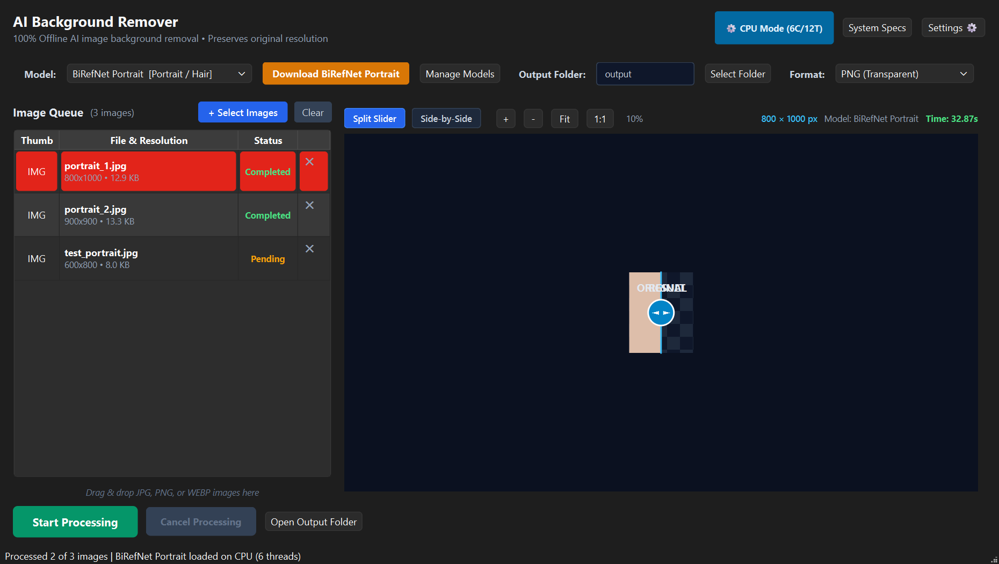
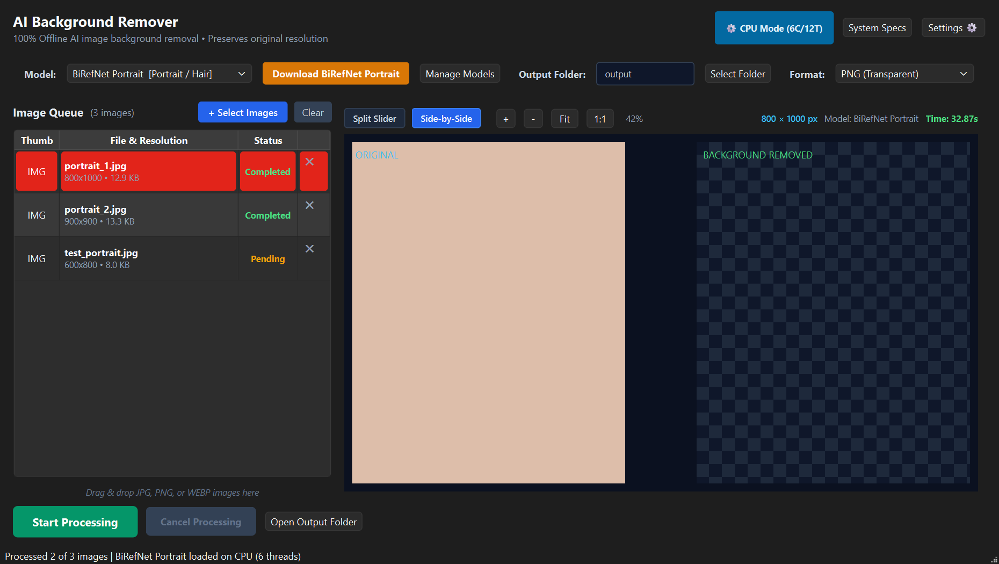

# AI Background Remover

[](https://opensource.org/licenses/Apache-2.0)
[](https://www.python.org/)
[-lightgrey.svg)](https://www.microsoft.com/windows)
[](https://github.com/Faizchonari/AI-Background-Remover/releases)

> **Fast, private, and high-precision desktop AI background removal running 100% locally on Windows.**

---

## Overview

**AI Background Remover** is a standalone Windows desktop application designed to remove image backgrounds with hair-strand precision. Powered by state-of-the-art vision models including **BiRefNet (Bilateral Reference Network)** and **RMBG**, the application runs entirely on your local machine with **zero cloud dependencies**, ensuring total data privacy.

<p align="center">
  
</p>

### Interactive Before/After Split Preview
<p align="center">
  
</p>

---

## Key Features

- **High-Precision Segmentation**: Uses BiRefNet for edge detection around difficult boundaries (fine hair, glass, transparent fabrics, fur).
- **Batch Processing Queue**: Drag-and-drop or select multiple JPG, JPEG, PNG, and WEBP images.
- **Resilient Pipeline**: Individual image failures (e.g. corrupted files) are captured gracefully without stopping the batch queue.
- **Interactive Split-View Preview**: Before/after comparison slider with transparency checkerboard, zoom controls, and fit-to-window.
- **100% Offline & Private**: All inference and logging occur strictly on your local machine. No telemetry, no cloud uploads.
- **Integrated Model Manager**: Atomic chunked downloading with SHA256 integrity verification and model update management.
- **Recommendation Engine**: Suggests optimal models based on content type and available system hardware.
- **Diagnostic & Repair Tools**: Built-in dependency manager and hardware inspector to verify and maintain the AI runtime.
- **Zero-Setup Installer**: Clean Windows installer (`AI-Background-Remover-Setup.exe`) that sets up shortcuts and preserves model weights across updates.

---

## Supported AI Models

| Model ID | Display Name | Architecture | Parameters | Size | Best For | License |
| :--- | :--- | :--- | :--- | :--- | :--- | :--- |
| `birefnet-portrait` | **BiRefNet Portrait** | Bilateral Reference Net | ~220M | ~2.1 GB | Humans, portraits, complex hair | Apache-2.0 |
| `birefnet-general` | **BiRefNet General** | Bilateral Reference Net | ~220M | ~2.1 GB | General objects, e-commerce, cars | Apache-2.0 |
| `birefnet-massive` | **BiRefNet Massive (DIS5K)** | Bilateral Reference Net | ~220M | ~2.2 GB | Fine-grained dichotomous segmentation | Apache-2.0 |
| `rmbg-1.4` | **RMBG-1.4** | Bria RMBG | ~170M | ~680 MB | Fast, lightweight processing | CC BY-NC 4.0 |

*Note: Model weights are subject to their respective licenses. See [THIRD_PARTY_NOTICES.md](THIRD_PARTY_NOTICES.md) for details.*

---

## Quick Start

### Option 1: Standalone Windows Installer (Recommended)

1. Download **`AI-Background-Remover-Setup.exe`** from [Releases](https://github.com/Faizchonari/AI-Background-Remover/releases).
2. Run the installer and follow the setup prompts.
3. Launch the application from your Start Menu or Desktop.
4. On first launch, open **Model Manager** to download your preferred model (e.g., BiRefNet Portrait).

### Option 2: Run from Source (Developers)

```powershell
# 1. Clone repository
git clone https://github.com/Faizchonari/AI-Background-Remover.git
cd AI-Background-Remover

# 2. Setup virtual environment
python -m venv .venv
.\.venv\Scripts\Activate.ps1

# 3. Install dependencies
pip install --upgrade pip
pip install -r requirements.txt
pip install -r requirements-dev.txt

# 4. Run application
python -m app.main
```

---

## System Requirements

| Component | Minimum (CPU Mode) | Recommended |
| :--- | :--- | :--- |
| **Operating System** | Windows 10 (64-bit Build 19041+) / Windows 11 | Windows 11 (64-bit) |
| **Processor** | 6-core x64 CPU (e.g. AMD Ryzen 5 / Intel i5 8th Gen+) | 8-core modern CPU or NVIDIA GPU (CUDA 11.8+) |
| **RAM** | 8 GB System RAM | 16 GB - 32 GB RAM |
| **Storage** | 2 GB for application + 3 GB per model | Fast NVMe SSD |
| **Display** | 1280 x 720 resolution | 1920 x 1080 resolution or higher |

For full details, see [docs/system-requirements.md](docs/system-requirements.md).

---

## Offline & Air-Gapped Usage

The application is built local-first:
- Models stored in `model_storage/` are loaded directly from disk.
- To use on an air-gapped machine, download models using `huggingface_hub.snapshot_download(..., local_dir_use_symlinks=False)` on an online machine and copy them to the `model_storage/` folder.
- Detailed instructions can be found in [docs/offline-mode.md](docs/offline-mode.md).

---

## Privacy & Security Notice

- **No Remote Telemetry**: Images are processed in-memory and written directly to your chosen local output directory.
- **Sanitized Logging**: Local logs in `logs/app.log` scrub user profile directory paths and never record image pixels or sensitive credentials.
- **Integrity Verification**: Downloads are verified against SHA256 checksums to guard against corrupted or tampered weights.

---

## Documentation

- [Installation Guide](docs/installation.md)
- [System Requirements](docs/system-requirements.md)
- [Supported Models](docs/models.md)
- [Offline & Air-Gapped Mode](docs/offline-mode.md)
- [Troubleshooting & Diagnostics](docs/troubleshooting.md)
- [Developer Guide](docs/development.md)
- [Contributing Guidelines](docs/contributing.md)

---

## License & Attribution

- **Application Source Code**: Licensed under the [Apache License, Version 2.0](LICENSE).
- **Third-Party Libraries & Models**: See [THIRD_PARTY_NOTICES.md](THIRD_PARTY_NOTICES.md) for full notices regarding PySide6 (LGPLv3), PyTorch (BSD), Transformers (Apache 2.0), Kornia (Apache 2.0), and AI model licenses.
